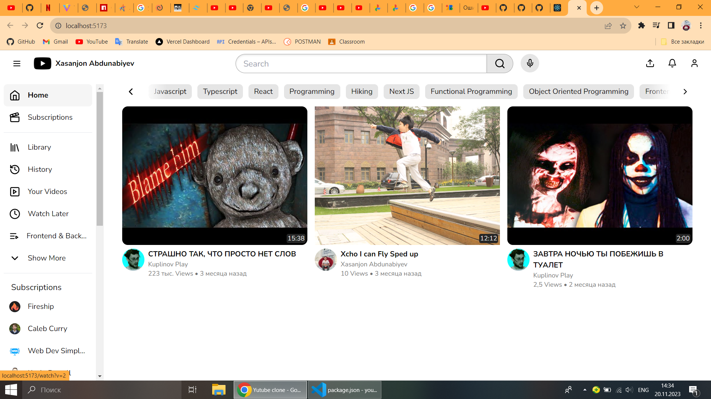

Youtube clone using react-typescript

You can learn more in the Create React App documentation.

To learn React, check out the React documentation.

Code Splitting
This section has moved here: https://facebook.github.io/create-react-app/docs/code-splitting

Analyzing the Bundle Size
This section has moved here: https://facebook.github.io/create-react-app/docs/analyzing-the-bundle-size

Making a Progressive Web App
This section has moved here: https://facebook.github.io/create-react-app/docs/making-a-progressive-web-app

Advanced Configuration
This section has moved here: https://facebook.github.io/create-react-app/docs/advanced-configuration

Deployment
This section has moved here: https://facebook.github.io/create-react-app/docs/deployment

npm run build fails to minify
This section has moved here: https://facebook.github.io/create-react-app/docs/troubleshooting#npm-run-build-fails-to-minify
